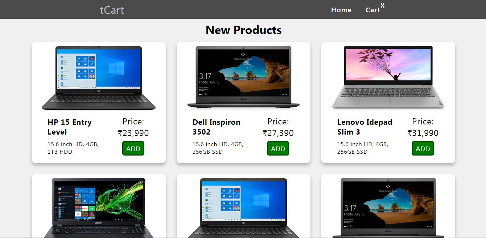
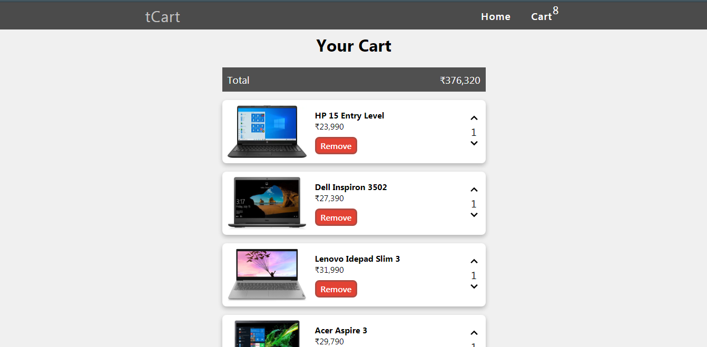
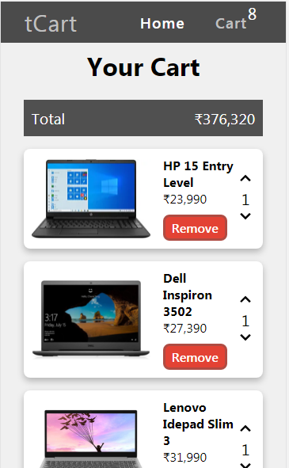

# React Shopping Cart using Context API, useReducer Hooks
## Uses Tcart API created by me to fetch product data [check Tcart API](https://tcartapi.herokuapp.com/)

### Home

### Cart

### Mobile Responsive

